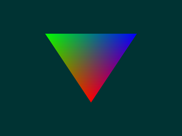

# Mepeyew

Computer graphics has gotten to the point where you can't just draw pixels onto
the screen directly anymore.
Instead, rendering APIs are used for drawing in order to efficiently utilize the hardware.
Each platform has its own preferred APIs (DirectX on Windows, Metal on
MacOS, etc), where each platform has its own little quirks and tricks.

Built in rust, `mepeyew` is meant to hide away these quirks in a nice and neat package while
trying to give you as much power as possible!



> The classic hello triangle!

## Basic Usage

> Warning! 
>
> Currently, this project is going through many changes and isn't stable! 🚧

Add this to your `Cargo.toml`:

```
mepeyew = "0.1"
```

### Code

Hey, welcome to the world of graphics programming.
I'm deeply sorry, but in this strange world, there is no such thing as "basic usage".
I'd like to put the classic triangle example code, but that would completely fill your screen.
Instead, I'd recommend checking [out this example in the docs](https://docs.rs/mepeyew/).
Or, for a more comprehensive set of examples, [checkout out the examples here on github](https://github.com/davnotdev/mepeyew/tree/main/examples).

## Road Map

This project is a work in progress!
The API is designed to be stable, but I can't guarentee anything of course.

- [x] Basic Uniforms
- [x] Textures
- [x] Shader Attachments
- [x] Documentation
- [x] v0.1 Release!
- [x] WGSL and Naga
- [x] WebGPU
- [ ] (Tested) Depth Buffers
- [ ] (Tested) Stencil Buffers
- [ ] MSAA
- [ ] Compute
- [ ] v0.2 Release!
