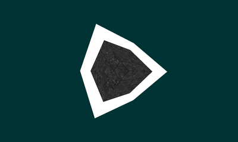
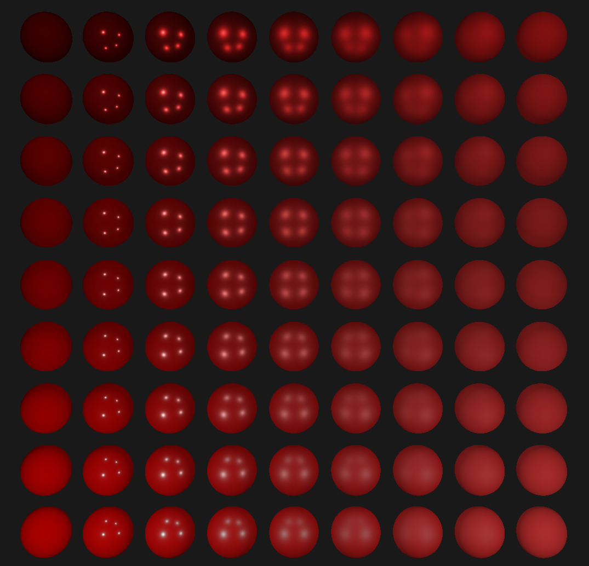

# Mepeyew

[](https://crates.io/crates/mepeyew)
[](https://docs.rs/mepeyew/latest/mepeyew/)
[](LICENSE)
[](https://crates.io/crates/mepeyew)

Computer graphics has gotten to the point where you can't just draw pixels onto
the screen directly anymore.
Instead, rendering APIs are used for drawing in order to efficiently utilize the hardware.
Each platform has its own set of preferred APIs (DirectX on Windows, Metal on
MacOS, etc), where said platform has its own little quirks and tricks.

Built in rust, `mepeyew` is meant to hide away these quirks in a nice and neat package while
trying to give you as much power as possible!

|       Hello Triangle       |          Outlined Cube          |      PBR Spheres      |
| :------------------------: | :-----------------------------: | :-------------------: |
|  |  |  |

## Platform Support

You can run `mepeyew` on Windows, MacOS, Linux, and the Web.
Currently, we support [Vulkan](https://www.vulkan.org/) and [WebGpu](https://developer.mozilla.org/en-US/docs/Web/API/WebGPU_API).
In terms of shading languages, we support [Glsl](<https://www.khronos.org/opengl/wiki/Core_Language_(GLSL)>), [Spirv](https://www.khronos.org/spir/), and [Wgsl](https://www.w3.org/TR/WGSL/) all with the help of [naga](https://github.com/gfx-rs/naga).

## Getting Started

Add this to your `Cargo.toml`:

```
mepeyew = "0.2"
```

This enables `mepeyew` with the following features:

- `vulkan`
- `webgpu`
- `surface_extension`
- `naga_translation`

If you do not plan on using these features, disabling them will decrease your dependency count.

To get started with using `mepeyew`, check out
[the examples here on Github](https://github.com/davnotdev/mepeyew/tree/main/examples).
They assume that you already understand graphics programming.

## Platform Dependent Nastiness

Unfortunately, not everything can be fully abstracted away!
Please read the [docs](https://docs.rs/mepeyew) before continuing!

## Using on MacOS

MacOS does not natively support Vulkan, so you will need to install LunarG's Vulkan SDK [from here](https://www.lunarg.com/vulkan-sdk/).
Then, you will need the following exports to proper compile.

```
VULKAN_SDK=$HOME/VulkanSDK/<version>/macOS
DYLD_FALLBACK_LIBRARY_PATH=$VULKAN_SDK/lib
VK_ICD_FILENAMES=$VULKAN_SDK/share/vulkan/icd.d/MoltenVK_icd.json
VK_LAYER_PATH=$VULKAN_SDK/share/vulkan/explicit_layer.d
```

## Using on the Web

> Be sure to see the documentation regarding `WebGpuInit` and `WebGpuInitFromWindow`.

The easiest way to get setup is to create an extra workspace member in your
`Cargo.toml`.

```
[workspace]
members = [
    "run_wasm"
]
```

Then, implement `run_wasm` exactly as shown in this repo.
This is very important as this project depends on my fork of `run_wasm` and
NOT the original crate.

Of course, you can use `wasm-pack`, `trunk`, or whatever else you'd like.

## Road Map

This project is mostly complete, but there are still bugs and changes that may come.
The API is designed to be stable, but I can't guarantee anything of course.

- [x] Basic Uniforms
- [x] Textures
- [x] Shader Attachments
- [x] Documentation
- [x] v0.1 Release!
- [x] WGSL and Naga
- [x] WebGPU
- [x] Depth Buffers
- [x] Stencil Buffers
- [x] MSAA
- [x] More Attachment Formats
- [x] Dynamic Viewport + Scissor
- [x] Dynamic Uniforms
- [x] Shader Storage Buffer Objects
- [x] Compute
- [x] Blending and Culling
- [x] Mipmaps and LOD
- [x] Instancing
- [x] Replace Shader Uniform Frequency
- [x] More Documentation
- [x] (Debug, Clone, Copy, Hash, PartialEq, Eq)-ify Everything
- [x] v0.2 Release!
- [x] Cubemaps
- [x] Async / Await
- [x] WebGpu Resizing
- [x] Remove `prelude`
- [ ] v0.3 Release!
